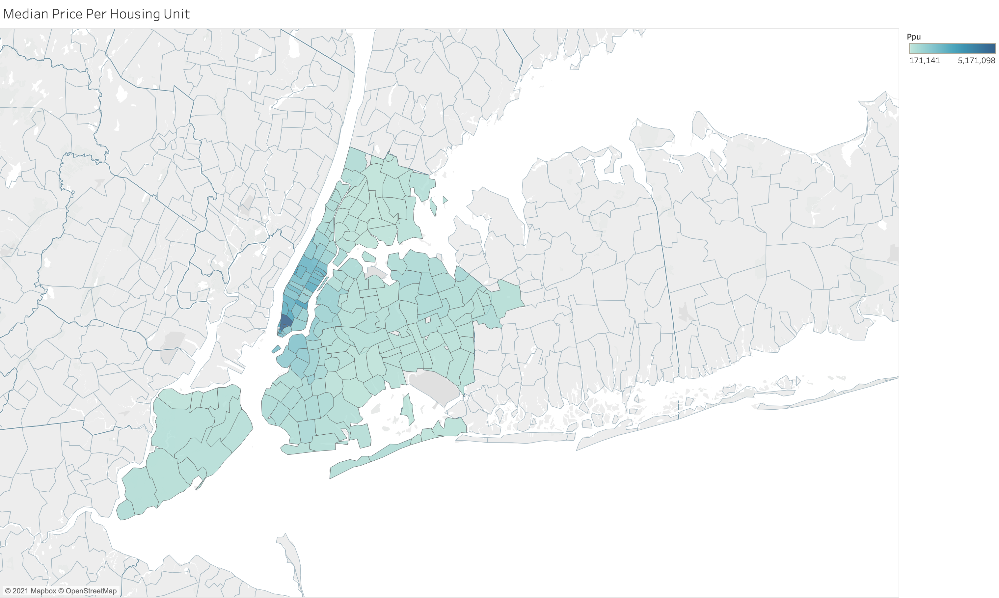
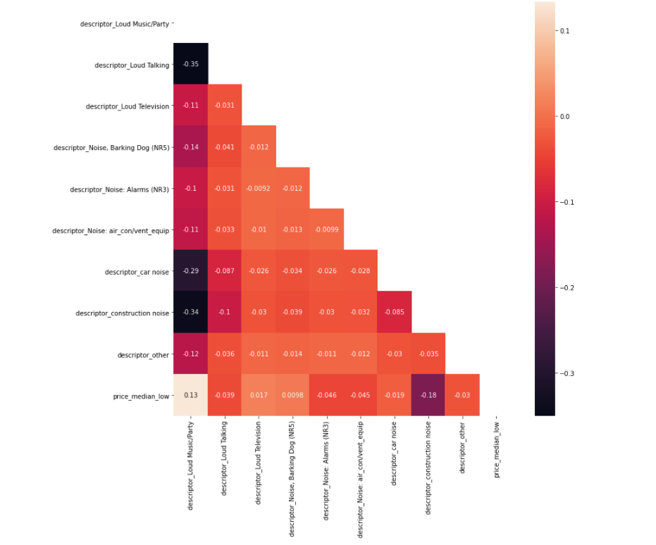
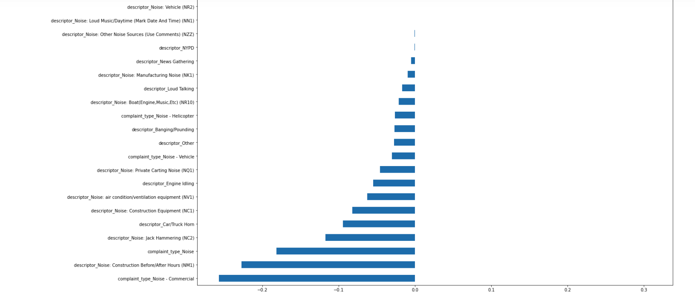
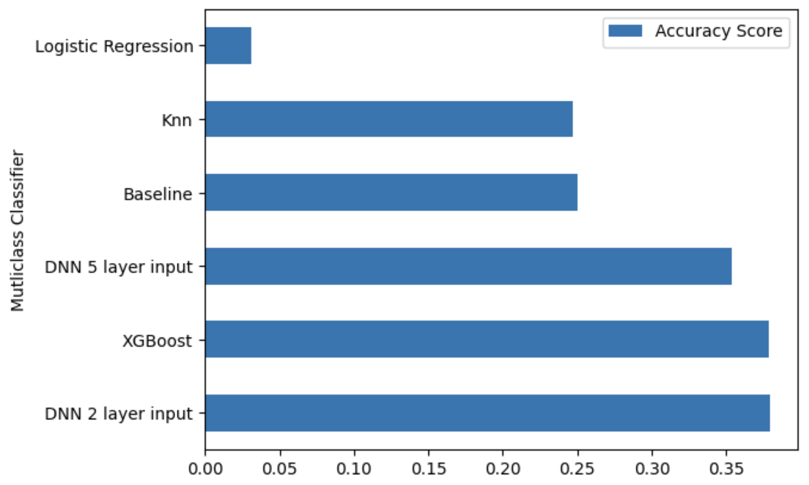

# Noise Complaints in NYC: Predicting Property Values with Noisy Neighbors

###### Map of New York City showing count of all noise complaints.

## Table of Contents 
- Introduction
- Data Sources
- Data Wrangling/EDA
- Feature Engineering
- Modeling
- Model Evaluation
- Conclusion
- Limitations
- Next Steps
- PART TWO!!!!

## Libraries
- Pandas
- NumPy
- BeautifulSoup
- Re
- SciPy
- scikit-learn
- Matplotlib
- seaborn
- TensorFlow

## Introduction

Noise affects everyone: no matter who you are or where you live, what is one person’s noise is simply the sound of another person’s daily life. In New York, there are two kinds of noise - the sounds of the city (car horns, loud neighbours, construction projects, barking dogs) and the sounds of New Yorkers complaining about them. In 2007, the city modernised its noise code for the first time in thirty years in order to make it easier for New Yorkers to report noise issues, allowing the authorities to measure the effect of noise on residents’ quality of life. 

Today, in order to file a noise complaint, New Yorkers simply have to pick up the phone and dial 311; unsurprisingly, they are making great use of this hotline. In 2014, the city logged over 140,000 complaints and in 2020 the city logged over 800,000 - more than one complaint per minute. What does this say about urban life? Is the city becoming noisier or are residents becoming more vocal?

Noise complaints are especially interesting because they can reflect differences in class, race and culture and provide insights into how a neighbourhood is changing as different people move around the city and live within close proximity to each other.

## Hypothesis
A neighbourhood with the most noise complaints isn’t the noisiest neighbourhood; it is the neighbourhood with the greatest self-selection bias. I was keen to use noise complaints reported from a neighbourhood to make predictions about the characteristics of people living there. For this project, I chose to predict the property values of neighbourhoods (as defined by postal codes) in New York City because housing prices are a good indicator of wealth and as I was able to find a detailed dataset containing sales records that was freely available to me. 

My hypothesis was that neighbourhoods with more noise complaints are wealthier on average and that I could predict whether or not the property values in a neighbourhood were above or below the average price based on the number and types of noise complaints logged in that neighbourhood.

## Data Sources: Noise Complaints and Property Sales from 2016-2020

### Open Data NYC 
- At the end of every day, all complaints logged with 311 are automatically uploaded to an online database where accessing them through the API is a breeze. 
- Each observation includes the type of complaint and descriptor of the noise, agency assigned to resolve complaint, resolution status and location information.
- The data is available from 2007.

### NYC Department of Finance
- Annualized sales files are freely available to the public and contain information about every property sale that has occurred in New York City. The columns include: price paid, full address, square footage, neighborhood, building and tax class codes and more. 
- The files are downloadable as one Excel spreadsheet per borough per year.
- The data is available from 2003.

Using data from 2016-2020 gave me a workable amount of observations. In order to merge these two datasets, I created a new column that combined the postal code and the year for each sale and each complaint eg. 11221-2016, 11221-2017, 11221-2018, etc.

## Data Wrangling and Exploratory Data Analysis

### Noise Complaints Data

The noise complaint data required little cleaning and was ready for EDA. After dropping unnecessary columns, I had 2,199,949 observations (unique complaints) from the last 5 years and 34 features to use to predict sale prices:

  

Residential Complaints and Loud Music/Party had the highest counts and they occurred in the same areas: Upper Manhattan and Central Brooklyn. As you can see from the maps below, noise complaints give a surprisingly detailed picture of the characteristics of a neighbourhood.

  
We'll see later in the 'Model Evaluation' section that construction complaints are a strong indicator of a high priced neighborhood:

  
The issue of barking dogs seems to be a universal nuisance:

  
The ice cream truck is driving residents crazy in three different neighborhoods. Unfortunately for them, the trucks' songs don't qualify as noise violations as long as they're only playing while the trucks are in motion:

  
There seems to be an issue in the East New York neighbourhood in particular with sound from a house of worship:

  

### Sales Data
Wrangling the property sales data into a usable condition required a significant amount of attention. I started with one Excel sheet per borough per year and my goal was to filter the information down to the average sale price of a residential unit (this could be a flat or single family house), per postcode per year. I refer to this number as the 'PPU': the price per unit.
  

Each year of sales had to be dealt with separately because the organization of the data varied slightly from year to year. I needed only residential property sales but the data also included sales for properties that were classed as commercial, industrial, and mixed-use, as well as whole blocks of flats, single flats and single-family houses. Using different tax and building class categories, I filtered out everything except residental houses, flat and residential flat blocks which gave me a mix of single unit sales and multi-flat sales. Many single flat sales were incorrectly labelled as containing multiple units and I corrected these by filtering the characters in the addresses of these properties with Regex. When an entire block of flats was sold, ie. a 150-unit apartment building sold for 24 million dollars, I divided the total building price by the number of units to get an estimate of a unit sale. 

Another challenge was dealing with outliers and abnormal transactions. There were many sales that did not occur at market rate and I needed to identify these and decide how to handle them. For example, in the lowest quartile of sales there were records of flats changing hands via inheritance for $0 and instances of businesses selling full buildings for $1 or $10. Many sales occurred below market rate in buildings that the housing authority restricted for people of specified income ranges. There were also outliers at the high end of the range that described sales occuring at market rate for up to $249 million for a single flat.

In the end, I removed the $0 dollar sales, included all abnormal transactions and kept the outliers and I was left with a price range of $1 to $249 million, a mean of $1.16 million and a median of $642,000. I decided to keep the outliers and abnormal sales because my data was heavily skewed and my range was huge; a single standard deviation was about $2.5 million.  This meant that the usual methods for removing outliers (taking 3 standard deviations from the median/mean, multiplying the IQR by 1.5 or cutting the highest and lowest 10th percentile of values) either extended my range into negative prices or cut off too much of the lower end of my data. I also did not have a systematic method for differentiating between abnormal sales in the first quartile and very inexpensive sales that truly did occur at market rate. For example, when I randomly spot checked sales records below $250,000 by manually researching the property, I found that in the same year there was a market rate sale of a studio flat in the Bronx for $80,000 as well as a sale of a large block of flats in Inwood for $100,000 that was clearly not a typical sale. 

By the time I took the average price per postcode and then used this as the binary or multi-class target in my classifiers (ie. if the price was high/low or if the price fell into one of four categories) the effect of including these records was negligible.
  

  

  

## Feature Engineering

After running a Chi-Square test, I confirmed that I had multicollinearity between features, as expected. I dealt with this by condensing similar features into single categories. For example, ‘car/truck music’, ‘car/truck honking’ and ‘engine idling’ were condensed into the single category ‘Vehicle Noise’. In addition to running models on all features together, I divided my features into ‘Complaint Types’ and ‘Descriptors’ and ran models on those individual groups. This did not improve my scores and neither did running PCA. 
  

 
Heatmap of condensed features
  

'Residential Noise' and 'party/music' noise had a clear connection with 'low price'. Unsurprisingly, 'loud talking' and 'street noise' were closely connected, and  'vehicle complaint type' and descriptions of vehicle-related noise were now perfectly correlated.

Heatmap of complaint types only
  

  

Heatmap of descriptors only
  

## Modelling

For my initial modelling, I experimented with using two different targets in my binary classifiers: the mean sale price and the median sale price. 
My aim was to predict whether or not the price was above or below either of these averages. There were upsides and downsides to using either the mean or the median. Using the mean as the target resulted in a large class imbalance but gave higher accuracy scores. Using the median gave a better balance (est. 50% baseline accuracy) but lower scores. Ultimately, I decided to use the median as the target because this resulted in a 24% score increase over baseline when I used a Decision Tree Classifier, the largest improvement of all my models.

Later, I changed my target to a multiclass where I categorised the prices as falling into one of four classes: low, mid-low, mid-high, high. Running multi-class classifiers was computationally heavy so I ran a RandomizedSearchCV to find the best parameters for a Logistic Regression classifier, which yielded dismal scores but the k-NN model showed promising results. I wished I had more time tune my parameters for k-NN and try more multiclass classifiers. 

- Median baseline with binary target (High price majority) = 0.5047

- Mean Baseline with binary target (Low price majority) = 0.7087

- Multiclass baseline split along quartiles:
  - Q3    0.253165
  - Q4    0.253165
  - Q1    0.246835
  - Q2    0.246835

  

## Model Evaluation

The logistic regression classifier gave insight into the impact of each coefficient on the target variable. The coefficients with the strongest negative impacts are construction related and they correspond to the likelihood of the median sale price being high. If you look at the maps above of construction noise complaints, you can see that the greatest concentration of construction complaints occur in the most expensive neighbourhoods of Manhattan, like TriBeca, where it is highly profitable to build more real estate.
  

  

Extracting the feature importances from the Decision Tree Classifier confirmed what I already knew: Residential Noise strongly impacts housing prices. This makes intuitive sense because this complaint type comprises over 50% of all complaints.
  

  

### Confusion Matrix and ROC Curve for Decision Tree Classifier

Label 1 = low price (below median) 

Label 2 = high price (above median)

This is the breakdown of the model’s correct and incorrect predictions and shows that the model correctly predicts true positives and true negatives the majority of the time.
  

## Conclusion & Key Learning
- In the first part of my hypothesis, I predicted that residents of wealthier neighbourhoods file more complaints: based on my findings, this was not correct. However, it would be interesting to investigate whether those neighbourhoods with the fastest rate of change in property values report more noise complaints: do noise complaints signal the gentrification of a neighborhood?
- As for the second part of my hypothesis, using a Decision Tree Classifier, I can predict with 63% accuracy whether the price of a home will be higher or lower than the median price of neighbourhood property values based on the noise complaints made in that neighbourhood. This is better than randomly guessing (or better than the accuracy score of 50%).
- Wrangling my raw property sales data down to a single average price per postcode required hours of cleaning. It was a great opportunity for a deep dive into Pandas and NumPy.
- Outliers: I spent a lot of time experimenting with different methods for eliminating outliers but in the end I found that keeping them had a minimal effect on my models.
- I was concerned about multicollinearity even after I consolidated my features. I ran models with different feature selections that I identified intuitively and with PCA my best models used all features.
- Tableau is wonderful for mapping visualizations.

## Limitations
- The large number of observations made running even very simple models very time consuming.
- The skewed distribution of sale prices affected my ability to deal with outliers.
- Even after feature engineering, I still had some feature dependency.
- I did not have streamlined methods to filter out abnormal sales.

## Next Steps
- Tune k-NN multiclass model and experiment with additional multiclass classifiers
- Experiment with additional feature engineering
- Run additional models on only the IQR of sale prices in order to deal with outlier challenges
- Explore specific clusters of complaints 
- Calculate the rate of change of property values over a period of years and use this as the target

## PART TWO!!
January 2023
I recently returned to this project to address a few obvious next steps that have nagged at me ever since I finished. When I was asked to present my work to colleagues at R2 Factory, Rolls Royce as a new starter, this seemed like the right opportunity to tie up loose ends. 

I wanted to see if I could improve my binary classifier scores with neural networks or any other models that I didn’t have time to try when I was last working on this. I also wanted to see if I could get anything worthwhile out of multiclass classification techniques or if my data really was just too skewed. 

In the end, I determined that unless I go back and re-aggregate my property sales data, I will always have issues with skew that will hold back any attempts at worthwhile multi-class classifications. Maybe someday I’ll do that, but if I was to continue playing around with noise complaints data, I’d rather use it to explore different demographic information. It’s time to put this particular project to bed!

### Findings for binary classifier - XGBoost for the win!
The baseline XGBoost model gave the best accuracy score of 0.6295. It is slightly higher than XGBoost with Hyperopt with Bayesian Optimisation (0.6293) and my best guess is that this just has something to do with the random sampling of combinations that bayesian optimisation would have started with.

The Keras sequential model did notably worse than the decision tree classifier.
  

  
   

### Findings for the multi-class classifier:
Four classes, split along quartiles. 

Still not great. Things definitely improved from the k-NN score, which is where I left it previously but I found that even after normalising with a box-cox transform, the best model always overpredicted the first quartile. Further below are the test predictions for the baseline Sequential model with 2 layers where you can see the overpredictions. 

  

  

